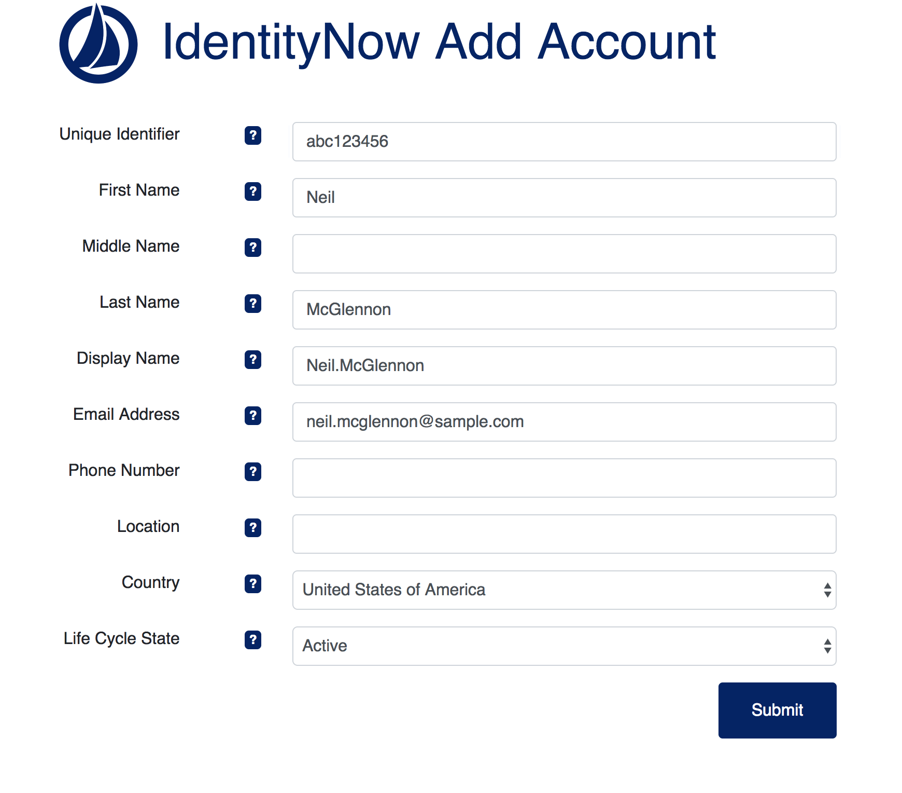

# IdentityNow - Accelerator for manual provisioning initiation

Author: [Neil McGlennon](mailto:neil.mcglennon@sailpoint.com)

## Overview

This is a simple IdentityNow app written in [Node.js](https://nodejs.org/en/), [React](), and [Bootstrap](). The purpose of this is to have a means to initiate provisioning of users to IdentityNow via REST APIs. While this isn't a full-featured application, it can be used as an example of how to develop such an app or integrate this functionality into a third party system. 

Note: this app will only ADD accounts into IdentityNow but has no other account management, and is intended to demonstrate how to use our platform API for adding accounts. It does not change, edit, delete, or otherwise manage accounts, and no support is included or implied.

## Caveats and Considerations

The accepted process flow for identities to be added into IdentityNow is for them to first have an account on an authoritative source, and then upon aggregation of that authoritative source (flat file, direct connect, etc.), the identity is created and any provisioning is done according to policies configured in IdentityNow via identity profiles, roles, and access profiles. The method of provisioning initiation that is used in this accelerator shortcuts the process of aggregation by adding user accounts to a source directly via API prior to aggregation of the source. However, IdentityNow is not the master of these accounts, and is not the system of record. It is expected that the users who are added via the API will be eventually added to the source through ordinary means and aggregated into IdentityNow. For the purposes of this exercise, users added via API should be considered temporary.

## Configuration

Overall the configuration for this is fairly easy, and contained in a single `config.js` file, which looks like this:

~~~
export const config = {
    source: "62863",
    title: "IdentityNow Add Account",
    tenant: {
        name: "my-org",
        url: "https://my-org.identitynow.com",
        clientId: "MKs...Y6u",
        clientSecret: "5Xz...nru"
    },
    formElements: [{
            name: "id",
            displayName: "Unique Identifier",
            tooltip: "This is the unique identifier of the person.",
            required: true,
            type: "string"
        },
			...
        {
            name: "country",
            displayName: "Country",
            tooltip: "This is the person's country.",
            required: false,
            type: "list",
            options: [
              {
                label: 'United States of America',
                value: 'US'
              }, {
                label: 'United Kingdom',
                value: 'UK'
              },{
                label: 'Germany',
                value: 'DE'
              }
            ]
        },
        {
            name: "lcs",
            displayName: "Life Cycle State",
            tooltip: "Enter the IdentityNow life cycle state for this user.",
            required: false,
            type: "list",
            options: [
              {
                label: 'Active',
                value: 'active'
              }, {
                label: 'Inactive',
                value: 'inactive'
              }
            ]
        }
    ]
};

export default config;
~~~

- **source** - This is the ID of the source which the account creations would show up as.
- **title** - This is the title of the registration page.
- **tenant** - This is the configuration information of the tenant which is being called.
- **formElements** - These are configurations for the various form fields.  These are made up of:
  - **name** - This is the technical account attribute name which will be submitted via the REST API.
  - **displayName** - This is the nice display name which is shown on the registration page.
  - **tooltip** - This is the tooltip 
  - **type** - Can be `string` or `list`.  If this is a `list` then also be sure to include `options` as well.
  - **options** - Used for a `list` of all available options in a drop down menu.

You can modify this `config.js` file to suit your particular requirements.

## Running

In order to run this, make sure you have [Node.js](https://nodejs.org/en/) installed.

From the `identitynow-user-add` folder, run:

~~~
$ npm start
~~~

Once this runs, you should see a startup that looks something like this:

~~~
> identitynow-user-add@1.0.0 start /Users/neil.mcglennon/Documents/Workspace/identitynow-services-tools/identitynow-user-add
> react-scripts start
Compiled successfully!

You can now view the app in the browser.

  Local:            http://localhost:3000/
  On Your Network:  http://172.16.52.46:3000/

Note that the development build is not optimized.
To create a production build, use npm run build.
~~~

Once this is complete, you can go to the URL and you should see the Add User page.

 

If configured correctly, once you fill out the form and submit it, the new user should show up in IdentityNow as if you aggregated it from the source:

Note that an identity cube will be created for this user if the source used is the authoritative source configured in an identity profile. Any additional provisioning actions will result according to IdentityNow configuration. However, if the source is later aggregated and the users who were added via API are not present in the flat file account feed for the source, then their account will be removed from the source in IdentityNow. This may result in uncorrelated accounts and removal of the idenitity cube.

## Questions / Issues

If you have any questions, feel free to contact [Neil McGlennon](mailto:neil.mcglennon@sailpoint.com). 
